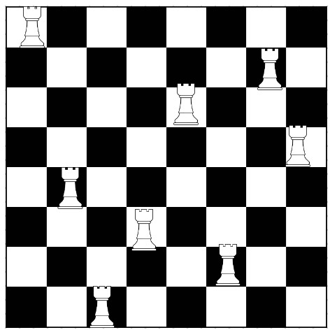

# Proiect-sincretic
## Temă proiect nr. 23

##### Pentek Iulia 
##### Anul II(licență)
##### Facultatea de Automatică și Calculatoare
##### specializarea Informatică

---

Cerința temei de proiect este următoarea:

**Problema celor 8 turnuri**: să se scrie un program care plasează 8 turnuri pe tabla de șah, fără ca acestea să se atace reciproc.

1. Introducere

Scopul programului este de a verifica atunci când opt turnuri așezate pe tabla de șah, nu se atacă reciproc. 
În șah, turnurile pot să se deplaseze pe tablă orizontal sau vertical pe toată lungimea tablei. 
Implementarea este realizată în limbajul de programare C și utilizează un algoritm de backtracking pentru a găsi soluția.
Mediul de dezvoltare utilizat pentru a scrie codul este *Visual Studio Code*. Toate aplicațiile utilizate în realizarea proiectului sunt: Visual Studio Code, GitHub, GitHub Desktop, Docker Desktop, Docker Hub, Command Prompt din Windows.
Există *92* de moduri unice de a plasa opt turnuri pe tabla de șah (8x8) astfel încât să nu se atace reciproc. 
Este important de menționat că acest număr include toate permutările distincte și rotirile pentru fiecare configurație. 
Acest rezultat este cunoscut sub numele de ,,Soluțiile celor opt regine" și a fost demonstrat pentru prima dată de către matematicianul Carl Friedrich Gauss. 
Aceasta este o problemă bine-cunoscută în teoria combinatorică și este rezolvată printr-o combinație de metode de programare și matematică.

2. Structura codului 

- Biblioteci

`#include <stdio.h>`
`#include <stdbool.h>`

Proiectul include bibliotecile standard pentru intrare/ieșire și pentru lucrul cu valori logice (adevărat/fals).

- Macrodefiniții

`#define N 8 // Dimensiunea tablei de șah`

Macrodefiniția *N* reprezintă dimensiunea tablei de șah și este setată la valoarea 8, corespunzătoare șahului standard de (8x8).

- Variabile Globale

`int tabla[N][N];`

Matricea tabla reprezintă tabla de șah și este folosită pentru a urmări poziționarea turnurilor.

- Funcții 

`bool mutare_valida(int row, int col);`

Această funcție verifică dacă o mutare (plasarea unui turn într-o anumită poziție) este validă. Se verifică dacă există deja un turn pe acel rând sau coloană.

`bool rezolva(int col);`

Funcția principală pentru rezolvarea problemei utilizând backtracking. Aceasta încearcă să plaseze turnurile unul câte unul pe coloane, verificând validitatea fiecărei mutări și revenind în cazul în care nu se găsește o soluție validă.

`void afiseaza_tabla();`

Funcție care afișează tabla de șah în consolă.

3. Funcționalitate 
 
- Inițializare

```
    // Inițializează tabla de șah cu 0
for (int i = 0; i < N; i++) {
    for (int j = 0; j < N; j++) {
        tabla[i][j] = 0;
    }
}
```

Tabla de șah este inițializată cu 0 la începutul programului.

- Rezolvare și Afișare

```
    if (rezolva(0)) {
    printf("Solutia gasita:\n");
    afiseaza_tabla();
}
else {
    printf("Nu exista o solutie.\n");
}
```

Se apelează funcția rezolva pentru a găsi o soluție, iar în funcție de rezultat, se afișează tabla de șah sau un mesaj că nu există o soluție.

4. Exemplu afișare

O soluție din cele 92 de soluții posibile este reprezentată în imaginea de mai jos:



5. Livrabil

- docker pull lia403/proiect-sincretic  
- sau [https://hub.docker.com/r/lia403/proiect-sincretic](https://hub.docker.com/r/lia403/proiect-sincretic)
- docker run --rm --name my-running-app lia403/proiect-sincretic

6. Bibliografie

Ca și resurse am folosit materialele primite de la domnul profesor Bocan Valer, acestea fiind cele postate pe *Campusul Virtual*: „Prezentare sistem de containere Docker” și „Rularea unui program C++ în container Docker”.
Am utilizat site-ul *Canva*([link](https://www.canva.com/)) pentru realizarea imaginii exemplu. 
Cartea *Limbajul C*(Kernighan, Brian W. ; Ritchie, Dennis M. ; Uţescu, Ionuţ(trad. ), Teora, 2003) pentru suport în scrierea codului.

7. Concluzie

Proiectul oferă o implementare eficientă pentru rezolvarea **Problemei Celor 8 Turnuri** utilizând algoritmul de backtracking. Este o soluție elegantă și ușor de înțeles pentru o problemă clasică în teoria problemei și este utilă pentru înțelegerea principiilor de bază ale algoritmilor de backtracking.